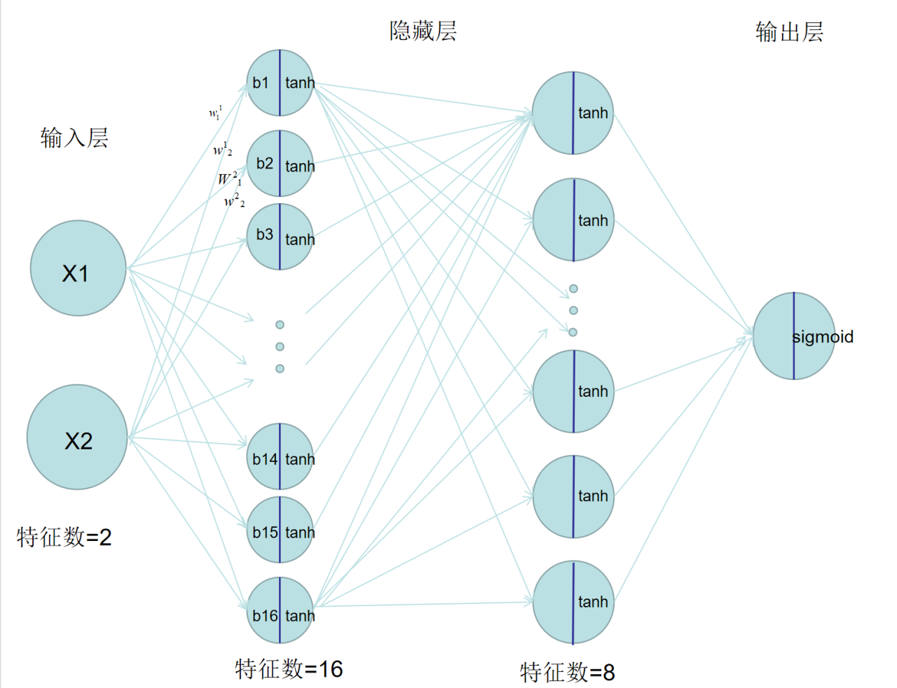
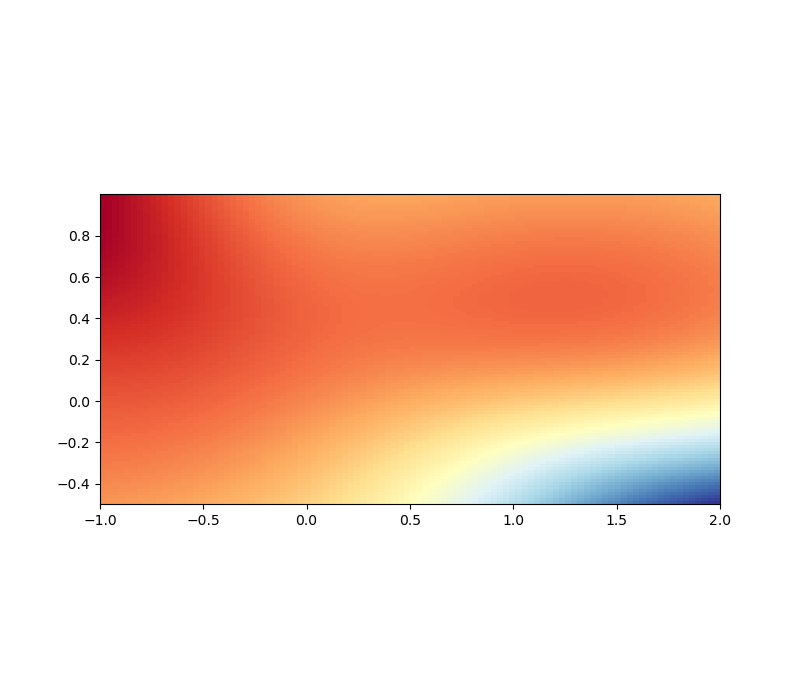
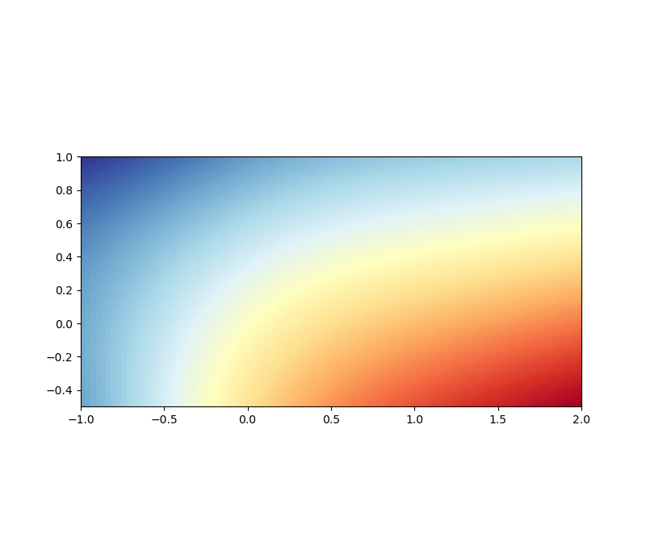
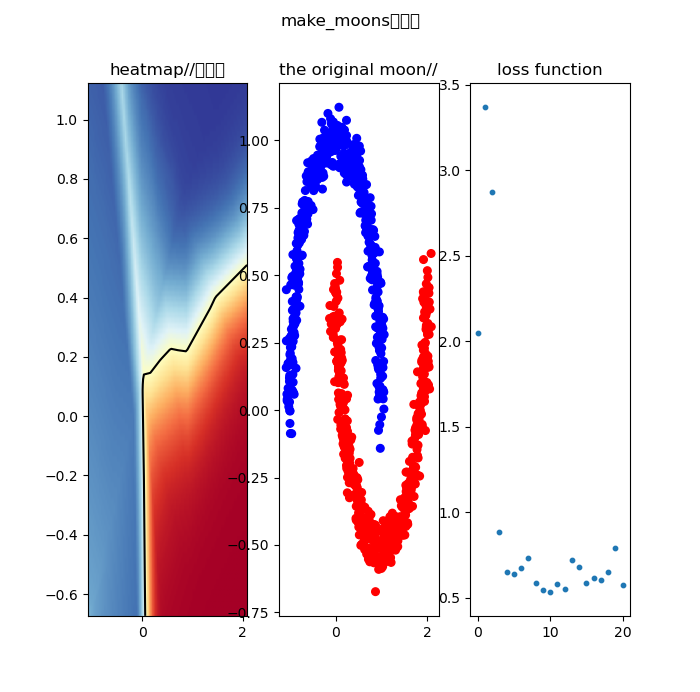

# Task1
## MLP相关问题回答
### 1.多层感知机(MLP)
多层感知机是有多层神经元的神经网络,解决了传统单层网络无法进行异或运算的问题
*((0,1)与(1,0)输出1,(1,1)和(0,0)输出0,无法用线分开这两组点)*;包含输入层,隐藏层,输出层
-   输入层:样本特征数=神经元数,每个神经元将所有特征经过线性运算提取出一个新特征
-   隐藏层:重复h矩阵运算提取特征,激活函数,输出的过程
-   输出层:根据任务目标输出特定维度的向量或矩阵,得到预测值用于和标签比较
### 2.数据的作用
数据是样本的集合,每个样本具有多种特征,"喂"给机器,看他的参数和数据经过算法得到的结果和实际值的差异,从而不断优化,用数据的特征训练模型参数,用数据的标签评价和优化模型:具体来说:
-   噪声是样本中不能对预测目标起到帮助的信息,可以分为:1.无关变量,如文本处理时的标点符号 2.有误信息:调查取得的数据中可能有人未反映真实情况
-   特征是与预测目标有相关性,并能据此估计预测目标的有用信息,对于不同目的,不同的信息可能是或不是特征,相当于中学生物中同一个变量在不同情景下可能是自变量或无关变量
-   标签:模型最终根据特征要去拟合的值,是模型输出(因变量)的评判标准
-   batch_size是每次输入到MLP的样本数,样本被合并为[batch_size,feature_num]的矩阵,堆叠后可以利用矩阵并行运算的能力,减少访问内存的频率,优化性能
### 3.神经元
神经元是每一层的复合函数,每个神经元会提取由上一层每个神经元输出的特征(或输入层提取样本的feature_num个特征),内部有一个权重向量(一层所有神经元的权重叠成权重矩阵,每一列是一个神经元的权重矩阵)与输入特征加权平均,再加上偏置项得到结果,再经过一个激活函数输出
### 4.激活函数
激活函数是每层神经元最后的一个简单但重要的非线性函数.如果没有激活函数,再多层的MLP也只是多层线性函数的复合函数,还是线性函数,无法学习并预测非线性规律,只能进行标准的线性回归;而有了线性函数,每层都加一点非线性,经过多层后能够复合成任意非线性函数,学习复杂特征此即**非线性表达能力**
常见激活函数:
-   1.Relu:```f(x)=max(0,x)```  **优点**:缓解梯度消失.如果每层函数导数<1,最终梯度越来越小,而w=w-w.grad的grad极小,几乎不更新.而relu在正半轴的倒数n恒为1,梯度在他这里不会减小  **缺点**:x<0时n神经元输出为0,若这个神经元接收到的特征都<0,无论输入什么,他永远输出0,导致n神经元死亡
-   2.LeakyRelu:在Relun基础上让负数的输出为lambda*x,lambda是极小值,缓解神经元死亡
-   3.sigmoid:``f(x)=1/(1+e^(-x))``函数为S型曲线,**优点:**输出(0,1)的值,可表示概率,进行二分类  **缺点:**x->0 or 1时S曲线平缓,导数接近0,导致梯度消失,因此一般不在隐藏层用,而在输出层用
-   4.softmax:``记S(x)=每个e^x之和,则f(x)=e^x/S(x)``,a相当于先把每个输入取指数,对应输出是其对应指数在指数和的占比,处理十分类问题
-   5.tanh:没错,就是数学数上的双曲正切,```f(x)=[e^(x)-e^(-x)]/[e^(x)+e^(-x)]```,输出(-1,1),与sigmoid最大区别在与输出区间,根据实际情况选取
### 5.计算图
-   计算图是对前向传播的可视化,每个节点代表变量或函数操作,边代表数据流动的方向;其中没有父节点的点叫叶子,断点测试时可看到is_leaf=True/False,没有子节点的点叫根,MLP中是损失函数(加上正则化),反向传播时以根为自变量,叶子为因变量计算梯度;
-   数据结构和离散数学中的计算图没有方向,而MLP的计算图要表示前向传播的方向
<p style="color:yellow">我的make_moons神经网络的计算图:</p>



### 6.参数
-   MLP的参数量是权重与偏置数量之和:每一层神经元有权重矩阵(输入特征数,神经元数)和偏置矩阵(神经元数,1),因此一层的参数量是:神经元数*(输入特征数+1),MLP的参数量就把每一层的参数量相加
-   超参数是反向传播过程中不进行优化的参数,只有在整个训练集训练完了后,才根据验证集指标调整.有:
    -   lr:learn rate 学习率,用来调整权重和偏置的调整幅度:w-=w.grad&lr
    -   batch_size:一次前向传播输入的样本量
    -   lambda:正则化大小,防止过拟合
    -   神经元的层数与每层的神经元数,即权重矩阵的数量和维度大小;
    -   epoch:训练轮数,每轮都把训练集跑完,可能跟着验证集衡量指标
### 7.隐藏层
-   隐藏层是除去输入层和输出层后,中间的神经层;因为这些层提取到的特征不是直接输入的特征,而是经过输入层提取到的特征;而它不直接输出预测结果,外部拿到的结果要经过输出层的神经元;因此,他既不与输入直接联系,也不直接输出,外部不可见,因此得名.
### 8.损失函数
-   损失函数计算预测值与实际值的差异,衡量误差,通过计算它的梯度,决定如何调整参数使损失值减小.<br>
常见损失函数:
-   1.均方误差:```-[sum((y_hat-y_label)**2)/len(y_hat)]```,即残差平方的均值,用于线性回归
-   2.交叉熵:```-[y_label*log(y_hat)+(1-y_hat)*(log(1-y_label))]``` 用于二分类或多分类
### 9.前向传播,梯度,学习率,优化器
-   前向传播:输入层 *提取特征* =>隐藏层 *不断提取高级特征*=>输出层 *输出预测结果*
-   梯度:自变量偏导数组成的向量,若自变量变化量组成的向量与梯度向量相反,则因变量减少最快
-   学习率:w=w-w.grad*lr的lr(learn rate),设置权重更新的幅度
-   反向传播:沿着计算图反向计算梯度,对权重矩阵和偏置矩阵减去他们的梯度与学习率之积,优化参数
-   优化器:
    -   1.随机梯度下降(SGD):每次随机在batch中选一个样本来计算损失函数,用来计算梯度更新权重.但容易陷入局部最优
    -   2.批量梯度下降(BGD):用整个batch计算,更新稳定,不过开销自然大
    -   3.小批量梯度下降MBGD:采一些样本计算,平衡梯度的稳定性和性能开销
    -   4.动量法(Momentum):将历史梯度纳入计算,与本轮梯度进行向量的线性计算,越同向更新速度越大,越反向更新速度越小.在损失函数曲面波动大的地方收敛更快,但容易冲过最优点,因为有历史累计的梯度的"惯性"在
    -   5.预判动量法(Nesterov):先根据历史梯度随惯性移动一步,再计算梯度,能够避免冲过最优点,计算量略大
    -   6.Adagrad:累计历史梯度平方和开根号作为分母,对频繁更新的参数减小学习率，对稀疏参数(低频特征)增大学习率,能够用不同幅度调整不同参数,但后期存在学习率太小的问题
    -   7.RMSprop:相对于Adagrad不再累计历史梯度,而是近期梯度,解决后期梯度小的问题
    -   8.Adam:既采用Momentum根据历史梯度大小存"动量",又利用RMSprop根据梯度变化率对不同参数调整幅度不同，同时解决收敛速度和学习率适配问题,通用性最强.但学习率是自适应(自己动态调整),L2正则化会削弱.
    -   9.AdamW:解决Adam的L2削弱问题,把公式中L2的项与学习率和自适应系数分开,先对参数做固定比例的衰减,再更新梯度,使得L2独立于梯度.
### 10.归一化,正则化
-   归一化是将一组数据处理到(0,1)的区间的方法,有两种方法:
    -   ```x=>(x-x.min())/(x.max()-x.min())```  但由于用最值压缩,容易受到极端值影响,比如最大值极大,分母太大,值接近0
    -   ```x=>(x-x.mean())/x.std()```用均值和方差计算,接近正态分布,缓解极值的影响,他也叫标准化
-   正则化防止模型过拟合,数学原理是通过减小参数,让导数变小,曲线更平滑,从而减小模型去拟合噪声而让曲线尖锐的问题,有四种减小方法,都是对损失函数减去一个多项式:
-   1.L1:参数绝对值之和的均值.计算简单,让某些参数为0,使参数稀疏,简化运算.但是绝对值导致某些导数可能为0,曲线不平滑,不利于优化器,且惩罚严格,可能丢失重要信息
-   2.L2:参数平方和的均值.曲线平滑,数值更稳定,但无法实现稀疏性
-   3.L1与L2加权平均,结合两者特点
-   4.Dropout:随机关闭一些神经元,减少神经元之间彼此依赖的关系(共适性),计算简单
### 11.欠拟合,过拟合
-   欠拟合是模型没有学习到特征与结果的关系,无论训练集,验证集,测试集的损失函数都很大,"训练了个寂寞";     
    
    -   可能原因:神经元太少,隐藏层层数少,学习率太小,正则化过强,激活函数的非线性表达能力不够(折线relu不如曲线tanh)   
-   过拟合:模型为了拟合极端值和噪声而较大幅度地调整参数,大幅扭曲曲线/面以经过尽可能多的点,仅管验证集的损失函数很小,但一到测试集,由于噪声不可能相同(否则就不是噪声了),模型却依然按照迎合原有噪声的畸形曲线/曲面来预测,结果离谱
    -   可能原因:复杂度太高,层数深,神经元参数多;训练参数少,导致噪声占比高;迭代次数过多;原始数据噪声本来就多

## 代码实践 make_moons
### 激活函数的选择
最初,我选择Relu函数来拟合双月曲线,不断尝试调整样本量,学习率,神经元个数,和层数.但效果极其有限,模型出现过下列症状:
-   红色/蓝色某一方占绝对优势,模型几乎把所有样本都归为一类,0.5分界线在角落
-   分界线不平滑,而是锯齿形
-   分界处附近的预测值是0.5左右,但某一侧的梯度很大,略微移动鼠标,数值突变到1或1e-30;另一侧梯度小,即使在最外侧,数值也始终在0.4-0.5或0.5-0.6左右

如下图:



 

究其本源,relu只是两个简单的线性函数,仅仅两层无法学习到月形曲线的非线性特征,也就是非线性表达能力不强,又考虑到sigmoid容易梯度消失,我最终选择tanh激活函数,成功拟合:


