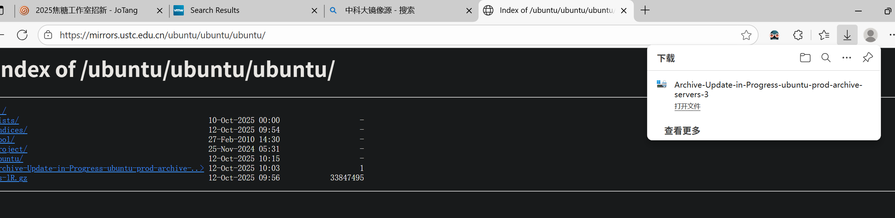
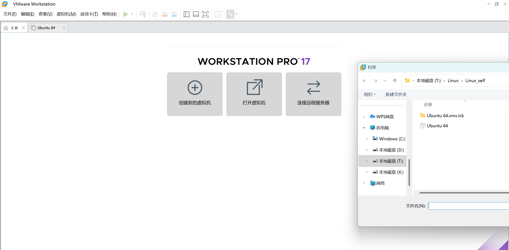
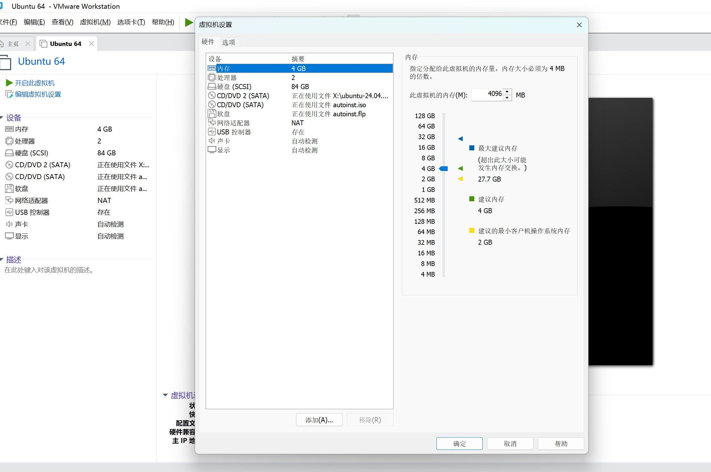

# Linux配置
## 虚拟机VMware下载
跟随b站视频在VMware官方网站下载，由于版本不同，需要在变更的页面寻找到下一个路径，这个步骤比较容易
## Ubuntu系统内核下载
-   网络原因导致下载速度极慢，约12h，后尝试清华园，网页，阿里等各个镜像网站，均不稳定，最终通过中科大镜像网站下载到Ubuntu内核;
-   后根据视频教程配置虚拟机，完成初始化并分配内存，知晓快照的功能，在后面的使用中发挥了挽救作用。

## 页面设置
-   初始时字体和图标太小，分辨率低，在设置中调整
-   常用软件VScode/QQ搬到侧栏顶端，以及自带的火狐浏览器，文件管理




## 基础配置
### VScode
从Linux应用市场直接下载VScode,但遇到无法用快捷键切换中文输入法的问题，且用鼠标输入中文就会闪现输入框，根本没法输入中文；导致开始做Task0和1时都只能用英文注释，把问题用英文发给GithUb Copilot，幸好它用中文回复，但效率太低。

<p style="color:yellow">解决方案：</p>
**卸载旧版，再在浏览器中下载VScode的Linux最新版，再操作过程中知晓了VScode会把自己再根目录注册为code程序，可再命令行输入code打开VScode**

### QQ
由于虚拟机和宿主机的文件无法拖给对方，也不能相互复制粘贴，我在没有配置VScode remote的情况下只能先下载QQ，在Linux和Windows上分别登录两个账号互传文件 

### 输入法
Linux自带的输入法没有记忆，每次打专有名词"神经网络，梯度，三维..."这些词都是折磨，最终我查找Linux能用的输入法，并根据搜狗输入法官方文档一步步输入命令，尽管此时并不会用命令行，只是Ctrl C+Ctrl V。

## 配置VScode remote连接
### 使用powershell
用powershell时才发现到除了cmd,Windows上还有这样一个命令工具。用它配置ssh公钥和私钥,让以后连接Linux可以免密登录
### ip连接
本来应该将Linux的ip地址写入Windows下.ssh文件的config，结果误把Windows的ip写进去了
```
Host balabala-vm
    HostName xxxxx
    User balabala
```
### 虚拟机开启状态
remote中出现了SSH的连接选项，但是始终连接不起，原来是虚拟机没开，自然没有网络桥接，连不上虚拟机ip
### 开启Windows上的代码体验
在Windows上写代码的体验比虚拟机中流程得多，linux上打中文时总是莫名其妙把一个英文字符打印出来，而拼音里缺少一个；浏览器无端地无响应，VScode地光标灵异地往下Enter几百行...这些统统不再。
同时，Linux用命令行可以轻松配置git,cmake这些Windows上麻烦的操作，远程连接集成了各家之长，同时还免去了用QQ自己给自己发文件的繁琐。
## bash命令行的系统学习
```bash
. #当前目录
.. #上一级目录
/ #根目录
~/ #home目录
./Codes/make_moons.py #当前目录下的Codes中的python文件
cd path #进入path路径
cd - #返回上一个操作时的路径
cd .. #返回父目录
mkdir folder #在当前目录创建名为folder的文件夹
rm -r folder #删除当前目录下的文件夹
rm  MLP.py #删除当前目录下的文件
mkdir build && cd ./build #创建再进入build文件夹
```